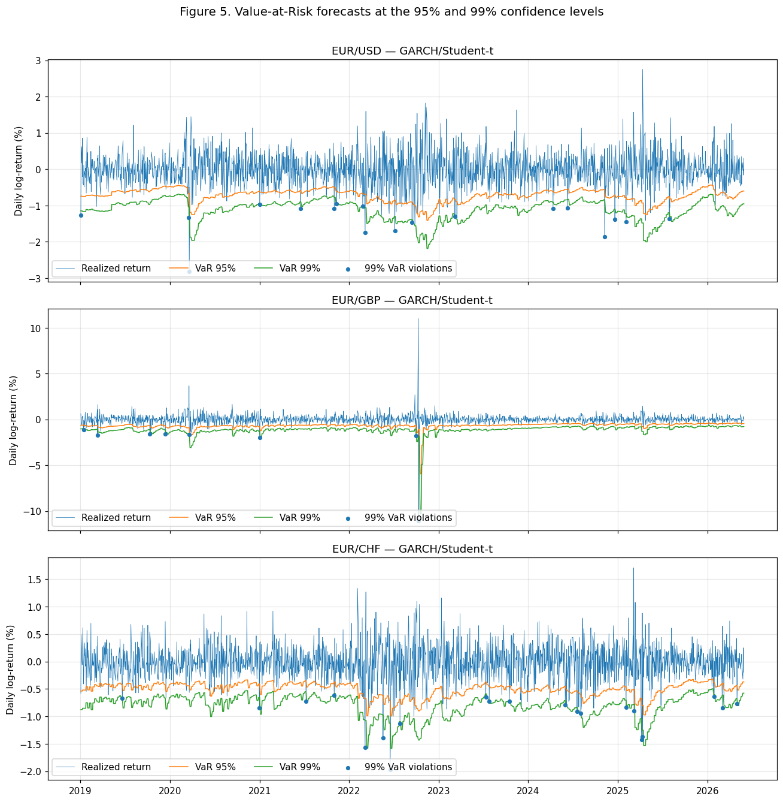

<div align="center">

# Foreign-Exchange Value-at-Risk with GARCH-Type Models

**Does modelling volatility really make currency-risk forecasts better —
and if so, is it the dynamics, the asymmetry, or the fat tails doing the work?**

<br>

[](https://www.python.org/)
[](https://arch.readthedocs.io/)
[](https://pandas.pydata.org/)
[](https://scipy.org/)
[](https://www.statsmodels.org/)

<sub>Seminar in Empirical Finance &amp; Financial Econometrics · University of Vienna</sub>

<br>

`3 euro pairs` · `10 models each` · `1,925 out-of-sample days` · `3 backtests` · `2015–2026`

</div>

---

> **TL;DR** — Across EUR/USD, EUR/GBP and EUR/CHF, the *innovation distribution* does most of the work,
> asymmetry barely earns its keep, and a plain **GARCH(1,1) with Student-t errors is very hard to beat**.
> It's Hansen &amp; Lunde (2005), reproduced out-of-sample with formal VaR backtesting.

<div align="center">

<br>
<sub><b>One-day-ahead 95% / 99% VaR</b> (GARCH/Student-t) against realized returns. The bands widen in stress —
COVID for USD, the Oct-2022 gilt spike for GBP — and tighten when markets are calm; dots mark 99% breaches.</sub>
</div>

---

## The question

Daily FX returns cluster in volatility and carry fatter tails than a normal distribution — exactly the
setting where a static, historical VaR is wrong precisely when it matters. GARCH-type models are the
textbook fix, but they come in many flavours, and "do they help?" is too vague to answer cleanly. So I
split it in two:

1. **Does modelling conditional volatility beat a non-parametric Historical Simulation at all?**
2. **Inside the GARCH family, where does any gain come from** — asymmetric ("leverage") dynamics, or
   fat-tailed / skewed innovations?

Throughout, *"better"* means **out-of-sample backtest performance** — correct coverage, no clustering, no
predictability — not in-sample fit.

## Data

|              |                                                        |
|--------------|--------------------------------------------------------|
| **Pairs**    | EUR/USD · EUR/GBP · EUR/CHF                             |
| **Window**   | 2 Mar 2015 – 29 May 2026, daily (≈ 2,925 returns/pair) |
| **Source**   | Yahoo Finance via `yfinance`                           |
| **Transform**| 100 · log-returns                                      |

The euro is held fixed so each pair isolates one counter-currency, and the three deliberately span the
tail-risk spectrum — USD liquid and near-symmetric, GBP jump-prone, CHF calm. The sample starts *after*
the January-2015 SNB de-peg, so EUR/CHF enters as a clean float instead of a managed peg plus a one-day
structural break.

## Design

A full 3 × 3 grid per currency, so each ingredient can be switched on and off on its own:

|                    | Gaussian | Student-t | Skewed-t |
|--------------------|:--------:|:---------:|:--------:|
| **GARCH(1,1)**     |    ✓     |     ✓     |    ✓     |
| **EGARCH(1,1)**    |    ✓     |     ✓     |    ✓     |
| **GJR-GARCH(1,1)** |    ✓     |     ✓     |    ✓     |

→ **9 parametric specifications** plus a non-parametric **Historical-Simulation** benchmark, for every pair.

VaR is forecast one day ahead at **95% and 99%**, on a **1,000-day rolling window** (re-estimated every 5
steps → **1,925 out-of-sample days**, 2019–2026), then judged by three backtests of rising strictness:

| Test | Asks | Rejects when… |
|------|------|---------------|
| **Kupiec** | is the *count* of breaches right? | too many / too few breaches |
| **Christoffersen** (conditional coverage) | right count **and** no clustering? | breaches bunch together |
| **Dynamic Quantile** (Engle–Manganelli) | are breaches predictable from the past? | any recent lag carries signal |

## Headline results

| Pair | Best by AIC | Out-of-sample verdict |
|------|-------------|-----------------------|
| **EUR/USD** | GARCH / Student-t | Symmetric GARCH &amp; GJR with Student-t / skewed-t clear all three tests at both levels — while **EGARCH is rejected**. |
| **EUR/GBP** | EGARCH / Skewed-t | The hard case. 95% is the binding constraint, cleared only by EGARCH/skewed-t, because a single Oct-2022 jump sets the tail. |
| **EUR/CHF** | GARCH / Student-t | GARCH/Student-t (and its skewed-t variants) pass cleanly at both levels; the Gaussian version fails the 99% tail. |

**Four things worth taking away:**

1. **Distribution beats dynamics.** Student-t and skewed-t win on AIC/BIC for every pair, and out-of-sample
   they cover the 99% tail where the Gaussian doesn't.
2. **Asymmetry barely pays for itself.** EGARCH is competitive in-sample but gets rejected out-of-sample for
   EUR/USD, and the estimated leverage terms sit near zero — FX just doesn't show the leverage effect that
   equities do.
3. **Historical VaR is globally right, locally wrong.** It gets the breach count about right but fails the
   Dynamic-Quantile test in 5 of 6 pair/level cases — being unconditional, its breaches stay predictable.
4. **One robust default.** If you must pick a single model for these euro pairs, it's **GARCH(1,1) (or GJR)
   with Student-t innovations** — parsimonious, numerically stable, and it passes across pairs and levels.

<details>
<summary><b>Repository layout</b></summary>

```
.
├── notebooks/
│   └── fx_garch_var.ipynb     # end-to-end: data → diagnostics → estimation → VaR → backtests
├── thesis/
│   ├── thesis.pdf             # full write-up (~14 pages)
│   └── thesis_proposal.pdf    # original project proposal
├── figures/
└── README.md
```

The notebook is the single entry point and reproduces every figure and table in the thesis.
</details>

<details>
<summary><b>Run it locally</b></summary>

```bash
pip install arch yfinance pandas numpy scipy statsmodels matplotlib jupyter
jupyter lab notebooks/fx_garch_var.ipynb
```

Data is pulled live from Yahoo Finance, so nothing is shipped in the repo. The rolling backtest re-fits
~10k models and runs in a couple of minutes; the in-sample and plotting cells are near-instant.
</details>

## Limitations &amp; potential extensions

- **No multiple-testing correction.** With 9 specs × 3 tests × 2 levels × 3 pairs, some passes are luck; a
  Model Confidence Set or Hansen's SPA test on a quantile loss is the principled fix.
- **VaR ignores tail severity.** Basel-III 97.5% Expected Shortfall, or an EVT / jump model, would handle
  the EUR/GBP deep tail better, since one 2022 move dominates it.
- **The benchmark is deliberately simple.** Filtered Historical Simulation or EWMA/RiskMetrics would be a
  fairer parametric competitor than plain HS.

<details>
<summary><b>Key references</b></summary>

- Bollerslev (1986); Nelson (1991); Glosten, Jagannathan &amp; Runkle (1993) — the GARCH family
- Hansen (1994) — skewed Student-t innovations
- Kupiec (1995); Christoffersen (1998); Engle &amp; Manganelli (2004) — the backtests
- Hansen &amp; Lunde (2005), *"Does anything beat a GARCH(1,1)?"* — the result this project reproduces for FX
</details>

---

<div align="center">
<sub>Joint seminar project with <b>Anna Belous</b> · supervised by Dr.techn. Philipp Gersing.<br>
The full methodology, tables and diagnostics are documented in the <a href="thesis/thesis.pdf"><b>thesis</b></a>.</sub>
</div>
